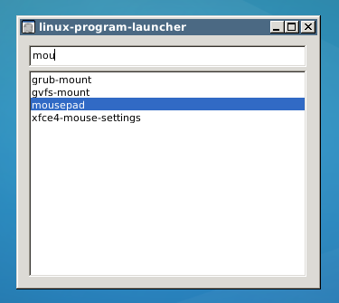

# linux-program-launcher
A program launcher for Linux created using Winforms.

#Functionality

It works by listing all the files in your /usr/bin directory. 

Then type away to search for your program. 

App launches selected program and exits when you press enter.

Alternatively, to exit simply hit ESC key.

#Setup

I'm running Xubuntu and using XFCE4 desktop environment. I have only tested using this.

Install mono runtime if you havent already.

Download the .exe and right click on icon and choose "Open with "Mono Runtime"". (Instead of "Open with mono Runtime (Terminal))

Move or copy it to /usr/bin.

Map left Windows key to this app! (In XFCE, run "xfce4-keyboard-settings", go to application shortcuts tab, click add button, type "linux-program-launcer.exe", press the desired key (i use left Windows key). 

And that's it! Try it out!
